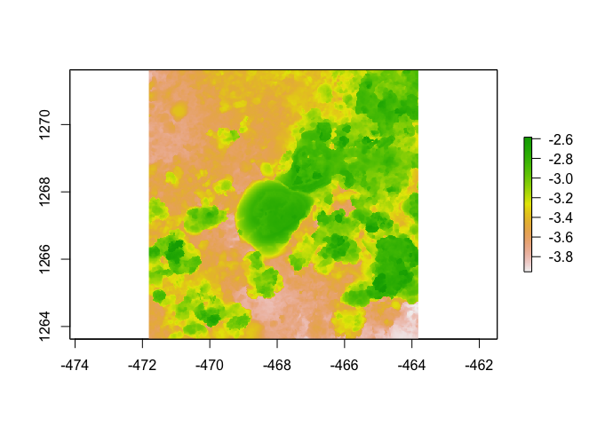

assignment
================
Justin Berg
2023-08-23

\##libraries

``` r
library(raster)
```

    ## Loading required package: sp

    ## The legacy packages maptools, rgdal, and rgeos, underpinning the sp package,
    ## which was just loaded, will retire in October 2023.
    ## Please refer to R-spatial evolution reports for details, especially
    ## https://r-spatial.org/r/2023/05/15/evolution4.html.
    ## It may be desirable to make the sf package available;
    ## package maintainers should consider adding sf to Suggests:.
    ## The sp package is now running under evolution status 2
    ##      (status 2 uses the sf package in place of rgdal)

``` r
library(habtools)
```

    ## 
    ## Attaching package: 'habtools'

    ## The following object is masked from 'package:raster':
    ## 
    ##     extent

``` r
library(ggplot2)
library(dplyr)
```

    ## 
    ## Attaching package: 'dplyr'

    ## The following objects are masked from 'package:raster':
    ## 
    ##     intersect, select, union

    ## The following objects are masked from 'package:stats':
    ## 
    ##     filter, lag

    ## The following objects are masked from 'package:base':
    ## 
    ##     intersect, setdiff, setequal, union

``` r
library(fishualize)

plot(horseshoe)
```

<!-- --> \##About
Me

\###Current lab: Nelson Lab \###Project focus: I will study runoff on
the coral microbiome and metabolome, specfically in West Maui and
possibly Guam. I also am aiding in the Donahue Lab nutrient experiment.
\###Why you chose this course: I wanted to learn new techniques about
coral reef photogrametry that could be used in my future work with
shifts in reefs that involce runoff. \###What do you want to learn about
the most in this course: I enter this class very open minded and hope to
walk away with a better understanding of how others may approach certain
coral related issues and to have an open dialogue about creative ways to
approach my future research goals and objectives. \###Your R experience:
I have taken advanced statistics in R last fall and have been modeling
and visualizing in R for the last 5 years. \###Fun fact: I love cooking
and eating new foods, so my girlfriend and I are cooking a meal from
each country around the world (currently have about 12 done).
